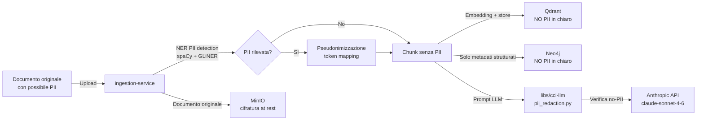

# GDPR Data Flow — CCI/AVCS

**Versione**: 0.1 — Draft
**Data**: 2026-05-29

## Flusso dati con indicazione di PII

## Basi giuridiche del trattamento

| Dato | Base giuridica | Retention | Responsabile |
|------|---------------|-----------|--------------|
| Documenti finanziari aziendali | Interesse legittimo (compliance) | 10 anni | Titolare del trattamento |
| Log di audit | Obbligo legale (AI Act art. 12) | 5 anni | Titolare del trattamento |
| PII pseudonimizzate nei chunk | Interesse legittimo | TTL 90 giorni | Titolare del trattamento |

## Right to Erasure (art. 17 GDPR)

`DELETE /documents/{id}` propaga la cancellazione a:
1. Qdrant: delete by `doc_id` filter
2. Neo4j: detach delete nodi con `provenance_doc_id`
3. MongoDB: set campi PII a `null` sul documento operazionale (marcatura "redacted")
4. Audit log: NON cancellato (integrità chain) — record di audit marcato `gdpr_erased: true`
5. MinIO: delete object

## Data Residency

Tutte le chiamate LLM passano da Anthropic API.
Meccanismi di conformità:
- Pseudonimizzazione PII prima dell'invio (vedi sopra)
- Zero retention policy Anthropic (accordo contrattuale)
- `ANTHROPIC_API_KEY` caricata da Vault, mai esposta
- Per dati clinici AOU con vincoli stretti: HITL blocca invio e richiede approvazione esplicita
